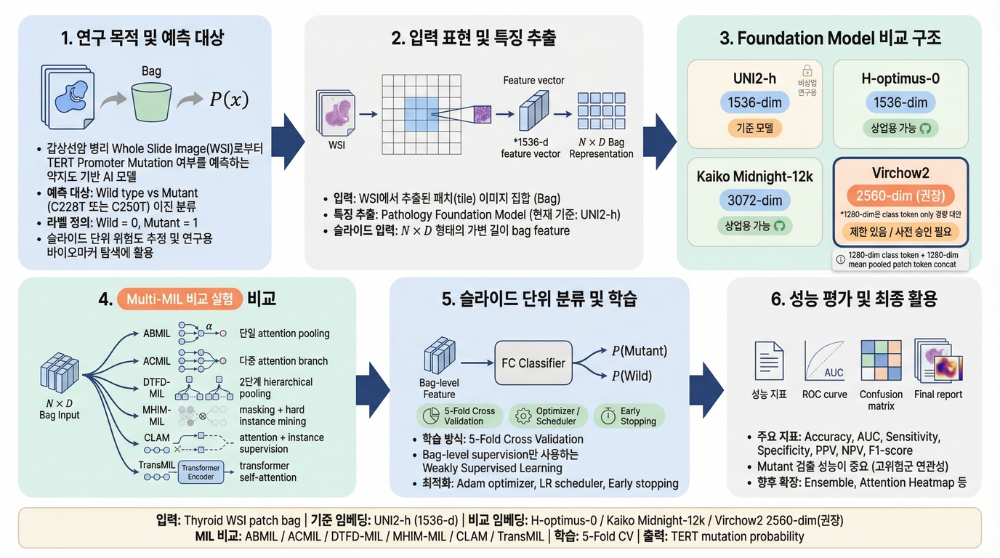

# Thyroid TERT Promoter Mutation Prediction (Public)

Public MIL training pipeline for TERT promoter mutation prediction from WSI patch embeddings.



## 1. Problem Definition
- Task: binary classification (`Wild=0`, `Mutant(C228T/C250T)=1`)
- Input: per-slide patch embedding arrays (`.npy`)
- Output: 5-fold CV metrics, checkpoints, plots, and attention heatmaps
- Supported models: `ABMIL`, `TransMIL`

## 2. Repository Structure
- `src/data/preprocess_data.py`: patch image -> embedding (`UNI2-h`)
- `src/data/run_embedding.sh`: helper to run subtype embedding jobs in parallel
- `src/data/create_cv_splits.py`: stratified K-fold split generation
- `src/training/main.py`: training entry point
- `src/training/train_tert.py`: core CV training/evaluation pipeline
- `src/training/train.sh`: shell wrapper with environment-variable overrides
- `src/training/mlflow_utils.py`: optional MLflow logging
- `src/training/register_model.py`: optional model registration
- `src/evaluation/visualization.py`: attention heatmap generation
- `config/cv_splits_tert_example.json`: CV split example format
- `config/tert_classification_template.json`: label/template example

## 3. Environment Setup
```bash
python -m venv .venv
source .venv/bin/activate
pip install -r requirements.txt
```

Recommended:
- Python 3.10+
- CUDA-enabled PyTorch environment for training/embedding

## 4. Expected Data Layout
Patch directory example:
```text
/path/to/40x_patch/
  C228T/
    TC_XX_0001/
      tile_x123_y456.png
  C250T/
  Wild/
```

Embedding output (from `preprocess_data.py`) example:
```text
/path/to/embedding/
  C228T/
    npy/TC_XX_0001.npy
    json/TC_XX_0001.json
  C250T/
  Wild/
```

## 5. Generate Embeddings
Single subtype:
```bash
python src/data/preprocess_data.py \
  --tile_dir /path/to/40x_patch/C228T \
  --out_dir /path/to/embedding/C228T \
  --batch_size 512
```

Parallel helper for all subtypes:
```bash
cd src/data
TILE_BASE=/path/to/40x_patch \
OUT_BASE=/path/to/embedding \
GPU_C228T=0 GPU_C250T=1 GPU_WILD=2 \
bash run_embedding.sh
```

## 6. Create CV Splits
```bash
python src/data/create_cv_splits.py \
  --data_root /path/to/embedding \
  --label_file /path/to/Thyroid_TERT_labels.xlsx \
  --output_dir /path/to/splits \
  --n_splits 5 \
  --seed 42 \
  --train_ratio 0.7 \
  --val_ratio 0.1 \
  --test_ratio 0.2
```

`cv_splits` JSON must contain `folds[*].train_wsis`, `val_wsis`, `test_wsis` with full `.npy` paths.

## 7. Train Model
Default run:
```bash
cd src/training
bash train.sh
```

Typical override:
```bash
cd src/training
CV_SPLIT_FILE=/path/to/cv_splits_tert.json \
MODEL_SAVE_DIR=/path/to/outputs/thyroid_tert_v0.1.0 \
MODEL_TYPE=transmil \
CUDA_VISIBLE_DEVICES=0 \
EPOCHS=100 \
LR=1e-4 \
BAG_SIZE=5000 \
bash train.sh
```

Notes:
- Data leakage check is enforced. Training aborts if overlap is detected between train/val/test.
- Main output summary file: `results_cv_summary_optimal.json`

## 8. Main Outputs
After training, `MODEL_SAVE_DIR` includes:
- `results_cv_summary_optimal.json`
- `attention_scores/attention_scores_fold*.json`
- `checkpoints/*.pt` (if `--save_model`)
- `visualizations/` (if `--generate_plots`)
- `heatmaps/` (best-fold attention heatmaps)

## 9. Optional MLflow Logging
Set environment variables before running training:
```bash
export MLFLOW_TRACKING_URI="https://your-mlflow-server"
export MLFLOW_EXPERIMENT_NAME="thyroid_tert"
export MLFLOW_TRACKING_INSECURE_TLS="false"
```

Optional model name for registration:
```bash
export MLFLOW_REGISTERED_MODEL_NAME="thyr-tert"
```

## 10. Security Notes
This public package removes internal host/IP/path details and keeps path placeholders only.
Do not commit:
- private dataset files
- internal credentials/tokens
- internal tracking server addresses
