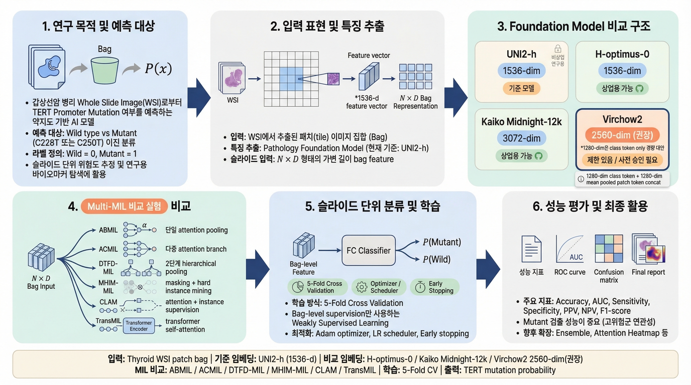

# Thyroid TERT Promoter Mutation Prediction

<p align="center">
  
</p>

WSI(Whole Slide Image)에서 추출한 patch-level embedding 기반으로 **TERT promoter mutation**을 예측하는 MIL 파이프라인입니다.

| 항목 | 내용 |
|---|---|
| Task | Binary (`Wild=0`, `Mutant(C228T/C250T)=1`) 또는 3-class (`Wild=0`, `C228T=1`, `C250T=2`) |
| Input | UNI2-H / H-Optimus-0 / H-Optimus-1 기반 1536-dim patch embedding (`.npy`) |
| Eval | Stratified 5-fold CV · Test는 Full WSI(전체 patch) 평가 |

---

## Dataset

총 **201 WSI** (`Wild 113` / `C228T 69` / `C250T 19`). 라벨은 SVS 파일명이 아닌 별도 Excel 기준으로 관리하며, 패치셋은 `40x 512×512`와 `20x 224×224 @ 0.5MPP`를 모두 보유.

**실제 데이터 스냅샷** (2026-05-08 확인, 총 약 2,696 GiB)

| Asset | Verified Count | Size | Notes |
|---|---:|---:|---|
| `thyroid/` | 201 `.svs` | 328.95 GiB | 원본 WSI |
| `40x_patch/` | 201 dirs / 4,273,287 `.png` | 1,770.08 GiB | UNI2-H · H-Optimus-0 40x 원본 |
| `20x_patch/` | 201 dirs / 5,259,005 `.png` + 201 `.done` | 514.99 GiB | H-Optimus-0 20x 원본 |
| `embedding/` | 201 `.npy` + 201 `.json` + 3 `all_slides.json` | 25.22 GiB | UNI2-H 40x |
| `h_optimus_embeddings/` | 201 `.npy` + 201 `.json` + 3 `all_slides.json` | 25.24 GiB | H-Optimus-0 40x |
| `h_optimus_embeddings_20x/` | 201 `.npy` + 201 `.json` + 3 `all_slides.json` | 31.06 GiB | H-Optimus-0 20x |
| `h_optimus_1_embeddings_40x/` | 201 `.npy` + 201 `.json` + 3 `all_slides.json` | 26 GiB | H-Optimus-1 40x (2026-09-18 확인) |

> `20x_patch/`의 regular file 총수 `5,259,206` 중 `201`개는 슬라이드별 완료 표시용 `*.done`.
> 각 embedding 디렉터리의 regular file 총수 `405`개 = slide-level metadata 201 + 클래스별 `all_slides.json` 3.

### Embedding Variants

| Encoder | 패치 기반 | 학습 버전 | 상태 |
|---|---|---|---|
| UNI2-H | 40x `512×512` | `v0.1.x ~ v0.5.x` | 완료 |
| H-Optimus-0 | 40x `512×512` → resize `224×224` | `v0.6.x ~ v0.8.x` | 완료 |
| H-Optimus-0 | 20x `224×224 @ 0.5MPP` | `v0.9.x ~` | 임베딩 완료 / 학습 예정 |
| H-Optimus-0 (3-class) | 40x `512×512` | `v0.10.x ~` | 학습 진행 중 |
| H-Optimus-1 | 40x `512×512` → resize `224×224` | `v0.11.x ~` | 임베딩 완료 / 학습 예정 |

경로는 각각 `{dataset_root}/{embedding, h_optimus_embeddings, h_optimus_embeddings_20x, h_optimus_1_embeddings_40x}/{class}/npy/`.

**H-Optimus-1 (임베딩 완료, 2026-09-18 확인)** — `bioptimus/H-optimus-1` (timm/HF Hub, ~1.1B, CC BY-NC-ND 4.0). 정규화 상수·출력 차원이 H-Optimus-0과 동일해 코드 차이는 모델 ID 한 줄뿐이며, CV split도 경로만 변환해 UNI2-H / H-Optimus-0 결과와 직접 비교가 가능하다. gated repo이므로 HF 토큰 인증 필요.

> **201/201 완료** (Wild 113 / C228T 69 / C250T 19), 총 4,273,287 패치 · WSI당 평균 21,260개로 40x 패치 총수와 일치해 누락 없음. 전수 검사에서 `float32 [N, 1536]` shape·dtype 이상 0건, 미완료 `.tmp.npy` 0건, 샘플 검사에서 NaN·all-zero row 미검출.
>
> 추출 과정에서 겪은 문제와 조치: fd 한도 초과(`Too many open files`)는 `set_sharing_strategy("file_system")`와 `ulimit -n 65536`으로, 중간 중단(GPU 탈락에 따른 NCCL watchdog timeout, 출력 디렉토리 쓰기 권한)은 완료된 `.npy`를 건너뛰는 resume 구조(`.tmp.npy` 기록 후 rename)로 해결해 작업 손실 없이 이어서 완료하였다.

---

## Supported MIL Models

| `model_type` | 설명 |
|---|---|
| `abmil` | Gated attention 기반 기본 MIL |
| `transmil` | Transformer MIL (Nyström attention + PPEG) |
| `acmil` | Attention-challenging MIL |
| `dtfd` | Double-tier feature distillation MIL |
| `mhim` | Masked hard instance mining MIL |
| `clam` | CLAM-SB style MIL |

## Training / Evaluation Protocol

| 항목 | 설정 |
|---|---|
| Train / Val / Test | Bag sampling (`bag_size`) / Full WSI / Full WSI |
| Threshold | 0.5 고정 |
| Optimizer | Adam (`lr=1e-4`, `weight_decay=1e-4`) |
| Scheduler | ReduceLROnPlateau (`patience=15`, `factor=0.5`) |
| Early stopping | Validation **loss** 기준 (`patience=8`, `min_delta=0.001`) |
| Loss | CrossEntropyLoss |

---

## Quick Start

### 1) 임베딩 추출

```bash
cd src/data/h-optimus-0 && bash run.sh          # V100 ×3, DDP, batch_size=512
cd src/data/h-optimus-1 && bash run.sh          # RTX 3080 ×3, DDP, batch_size=32 (HF 토큰 필요)
cd src/data/uni2-h      && bash run_embedding.sh
```

> 추출기는 완료된 `.npy`를 건너뛰는 resume 구조라, 중단 후 같은 명령을 다시 실행하면 남은 슬라이드부터 이어서 진행된다.

### 2) CV split 생성 (H-Optimus용)

```bash
python src/data/create_cv_splits_hoptimus.py \
  --old_root {dataset_root}/embedding \
  --new_root {dataset_root}/h_optimus_embeddings_20x \
  --output_json config/cv_splits_tert_5fold_seed42_hoptimus_20x.json \
  --verify   # 임베딩 파일 존재 여부 검증 (선택)
```

### 3) 학습

```bash
cd src/training && bash train.sh
```

또는 직접 실행:

```bash
python src/training/main.py \
  --model_save_dir outputs/thyroid_tert_model_vX.X.X \
  --cv_split_file config/cv_splits_tert_5fold_seed42_hoptimus_20x.json \
  --model_type abmil \
  --epochs 100 --lr 1e-4 --bag_size 1000 \
  --save_model --save_best_only --generate_plots
```

`train.sh`에서 수정할 주요 항목: `CV_SPLIT_FILE` (UNI2-H / H-Optimus 전환), `MODEL_SAVE_DIR`, `MODEL_TYPE`, `BAG_SIZE`, `EMBED_DIM`, `ATTN_DIM`.

### 4) MLflow 등록

```bash
cd src/inference && python register_model.py --model_save_dir ../../outputs/thyroid_tert_model_vX.X.X
```

- Tracking URI: `http://localhost:5000` · Registered Model: `thyr-tert`

---

## Project Structure

```text
src/
├── data/         # 임베딩 추출 (uni2-h/ · h-optimus-0/ · h-optimus-1/)
│                 # create_cv_splits{,_hoptimus}.py · datasets.py · tert_common.py
├── models/       # abmil · transmil · acmil · dtfd · mhim · clam + mil_template.py
├── training/     # main.py · train_tert.py · train.sh · mlflow_utils.py
├── inference/    # register_model.py · export_torchscript.py · kpi_eval.py
└── evaluation/   # metric.py · visualization.py

config/           # cv_splits_tert_5fold_seed42{,_hoptimus,_hoptimus_20x,_hoptimus_3class}.json
                  # tert_classification.json
outputs/
└── thyroid_tert_model_vX.X.X/   # checkpoints · attention_scores · visualizations · heatmaps
                                 # results_cv_summary_optimal.json
```

---

## Experiment Results

### UNI2-H (40x 512×512)

| run_dir | model_type | AUC | F1 | Acc | Sens | Spec |
|---|---|---:|---:|---:|---:|---:|
| thyroid_tert_v0.1.3 | abmil | **0.9711** | 0.8691 | 0.8756 | 0.9098 | 0.8470 |
| thyroid_tert_model_v0.2.2 | abmil | 0.9699 | **0.9312** | 0.9404 | 0.9209 | 0.9557 |
| thyroid_tert_model_v0.2.5 | abmil | 0.9652 | 0.9297 | **0.9406** | 0.8987 | 0.9739 |
| thyroid_tert_model_v0.3.2 | transmil | 0.9513 | 0.8745 | 0.8906 | 0.8536 | 0.9194 |

### H-Optimus-0 (40x → resize 224×224, v0.6.x~v0.8.x)

| run_dir | model_type | AUC | F1 | Acc | Sens | Spec |
|---|---|---:|---:|---:|---:|---:|
| thyroid_tert_model_v0.6.0 | abmil | **0.9716** | 0.8997 | 0.9106 | 0.9098 | 0.9107 |
| thyroid_tert_model_v0.7.2 | transmil | 0.9575 | 0.8926 | 0.9106 | 0.8536 | 0.9549 |
| thyroid_tert_model_v0.8.9 | acmil | 0.9626 | 0.9031 | 0.9104 | 0.9209 | 0.9008 |

### 진행 중

| 실험 | 구성 | 상태 |
|---|---|---|
| H-Optimus-0 20x (`v0.9.x~`) | 20x 224×224 · binary | 임베딩 `201/201` 완료, 결과 없음 |
| H-Optimus-0 3-class (`v0.10.x~`) | 40x 512×512 · argmax (threshold 미적용)<br>split: `..._hoptimus_3class.json` | `v0.10.0` 학습 중 (abmil, bag_size=500) |
| H-Optimus-1 40x (`v0.11.x~`) | 40x 512×512 → resize 224×224 · binary | 임베딩 `201/201` 완료, 학습 예정 |
